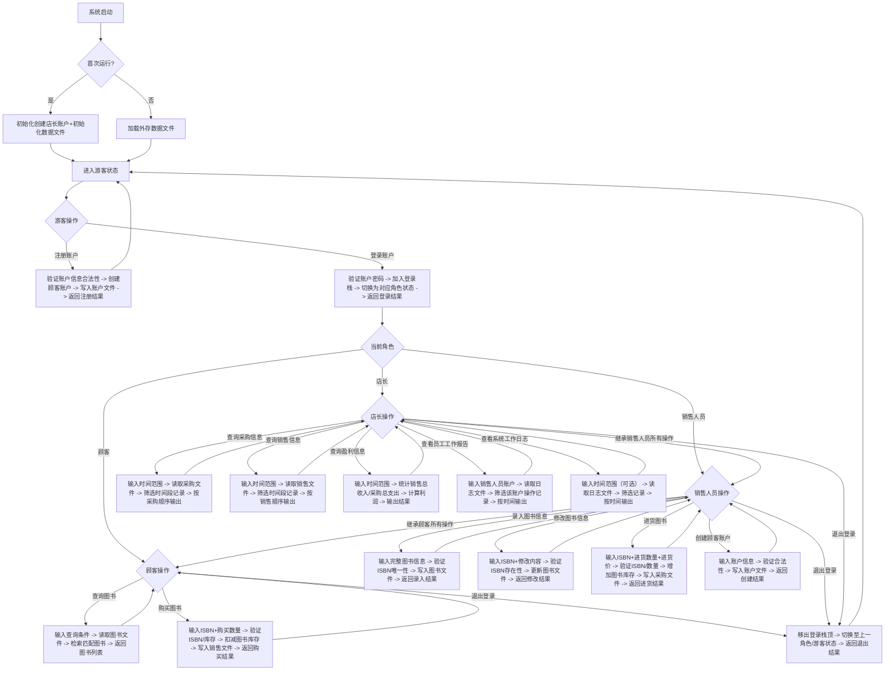
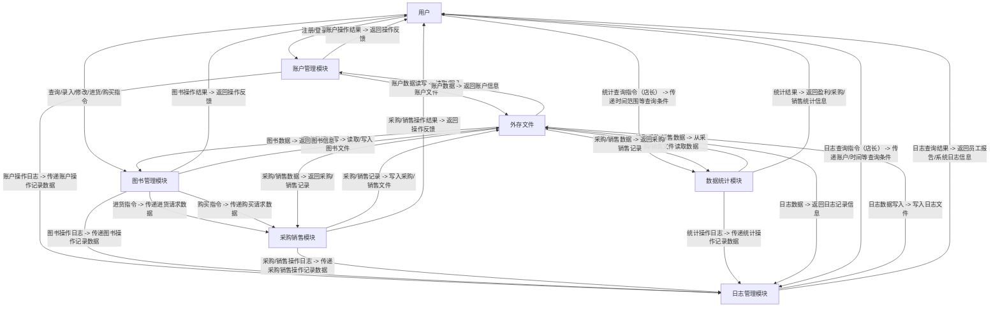

# 需求分析文档

## 业务流图

## 数据流图

## 数据词典
### 数据流表
| 数据流名称 | 数据结构 | 外部实体 | 处理过程 | 说明 |
| --- | --- | --- | --- | --- |
| 注册请求 | {账户名（account_name）、密码（password）} | 游客 | 账户注册 | 游客提交的创建顾客账户的请求数据 |
| 登录请求 | {账户名（account_name）、密码（password）} | 用户 | 账户登录 | 用户提交的登录系统的请求数据 |
| 退出登录请求 | 无 | 用户 | 退出登录 | 用户提交的退出当前登录账户的请求 |
| 创建顾客账户请求 | {账户名（account_name）、密码（password）} | 销售人员 / 店长 | 创建顾客账户 | 销售人员 / 店长提交的创建顾客账户的请求数据 |
| 图书录入请求 | {ISBN（isbn）、书名（book_name）、作者（author）、关键字（keywords）、库存量（stock）、单价（price）} | 销售人员 / 店长 | 图书信息录入 | 销售人员 / 店长提交的新增图书完整信息的请求数据 |
| 图书修改请求 | {ISBN（isbn）、待修改字段（book_name/author/keywords/price）及对应值} | 销售人员 / 店长 | 图书信息修改 | 销售人员 / 店长提交的修改已有图书信息的请求数据 |
| 图书查询请求 | {查询条件（isbn/author/keywords/book_name，可选组合）} | 用户 | 图书查询 | 用户提交的查询图书的请求数据（支持多条件组合） |
| 进货请求 | {ISBN（isbn）、进货数量（purchase_num）、进货价格（purchase_price）} | 销售人员 / 店长 | 图书进货 | 销售人员 / 店长提交的图书进货请求数据 |
| 购买请求 | {ISBN（isbn）、购买数量（sale_num）} | 用户 | 图书购买 | 用户提交的图书购买请求数据 |
| 采购信息查询请求 | {开始时间（start_time）、结束时间（end_time）} | 店长 | 采购信息查询 | 店长提交的查询指定时间段采购记录的请求数据 |
| 销售信息查询请求 | {开始时间（start_time）、结束时间（end_time）} | 店长 | 销售信息查询 | 店长提交的查询指定时间段销售记录的请求数据 |
| 盈利信息查询请求 | {开始时间（start_time）、结束时间（end_time）} | 店长 | 盈利信息查询 | 店长提交的查询指定时间段盈利数据的请求数据 |
| 员工工作报告查询请求 | {销售人员账户名（operate_account）、开始时间（start_time，可选）、结束时间（end_time，可选）} | 店长 | 员工工作报告查询 | 店长提交的查询指定销售人员操作记录的请求数据 |
| 系统日志查询请求 | {开始时间（start_time，可选）、结束时间（end_time，可选）} | 店长 | 系统工作日志查询 | 店长提交的查询系统操作日志的请求数据 |
| 账户操作结果 | {操作结果（operate_result）、提示信息（msg）、角色（role，登录成功时返回）} | 外部实体：用户 | 处理过程：账户管理模块 | 账户注册 / 登录 / 退出 / 创建顾客账户的执行结果反馈 |
| 图书操作结果 | {操作结果（operate_result）、提示信息（msg）、图书信息（book_info，修改 / 查询成功时返回）、库存量（stock，进货 / 购买成功时返回）} | 外部实体：用户 | 处理过程：图书管理模块 | 图书录入 / 修改 / 查询 / 进货 / 购买的执行结果反馈 |
| 统计查询结果 | {采购记录列表（purchase_list）/ 销售记录列表（sale_list）/ 盈利数据（profit_data）/ 员工操作记录列表（employee_log_list）/ 系统日志列表（system_log_list）} | 外部实体：店长 | 处理过程：数据统计模块 / 日志管理模块 | 采购 / 销售 / 盈利 / 员工报告 / 系统日志查询的执行结果反馈 |
| 账户数据 | {账户名（account_name）、密码（password）、角色（role）、创建时间（create_time）} | 数据存储：账户文件 | 处理过程：账户管理模块 | 从账户文件读取的账户完整数据，用于登录验证、权限判断等 |
| 图书数据 | {ISBN（isbn）、书名（book_name）、作者（author）、关键字（keywords）、库存量（stock）、单价（price）、最后更新时间（update_time）、进价（enter_price）} | 数据存储：图书文件 | 处理过程：图书管理模块 | 从图书文件读取的图书完整数据，用于查询、修改、库存验证等 |
| 采购记录数据 | {采购 ID（purchase_id）、ISBN（isbn）、进货数量（purchase_num）、进货价格（purchase_price）、进货时间（purchase_time）、操作账户（operate_account）} | 数据存储：采购文件 | 处理过程：采购信息查询 / 盈利信息查询 | 从采购文件读取的采购记录数据，用于查询和盈利计算 |
| 销售记录数据 | {销售 ID（sale_id）、ISBN（isbn）、销售数量（sale_num）、销售单价（sale_price）、销售时间（sale_time）、操作账户（operate_account）} | 数据存储：销售文件 | 处理过程：销售信息查询 / 盈利信息查询 | 从销售文件读取的销售记录数据，用于查询和盈利计算 |
| 日志数据 | {日志 ID（log_id）、操作账户（operate_account）、操作类型（operate_type）、操作对象（operate_object）、操作时间（operate_time）、操作结果（operate_result）、操作详情（operate_detail）} | 数据存储：日志文件 | 处理过程：员工工作报告查询 / 系统工作日志查询 | 从日志文件读取的操作日志数据，用于员工报告和系统日志查询 |
| 新增账户数据 | {账户名（account_name）、密码（password）、角色（role）、创建时间（create_time）} | 数据存储：账户文件 | 处理过程：账户注册 / 创建顾客账户 | 需写入账户文件的新账户完整数据 |
| 新增图书数据 | {ISBN（isbn）、书名（book_name）、作者（author）、关键字（keywords）、库存量（stock）、单价（price）、最后更新时间（update_time）} | 数据存储：图书文件 | 处理过程：图书信息录入 | 需写入图书文件的新图书完整数据 |
| 更新图书数据 | {ISBN（isbn）、修改后的字段值、最后更新时间（update_time）} | 数据存储：图书文件 | 处理过程：图书信息修改 / 进货 / 购买 | 需更新到图书文件的图书数据（如修改后的属性、调整后的库存） |
| 新增采购记录数据 | {采购 ID（purchase_id）、ISBN（isbn）、进货数量（purchase_num）、进货价格（purchase_price）、进货时间（purchase_time）、操作账户（operate_account）} | 数据存储：采购文件 | 处理过程：图书进货 | 需写入采购文件的新采购记录数据 |
| 新增销售记录数据 | {销售 ID（sale_id）、ISBN（isbn）、销售数量（sale_num）、销售单价（sale_price）、销售时间（sale_time）、操作账户（operate_account）} | 数据存储：销售文件 | 处理过程：图书购买 | 需写入销售文件的新销售记录数据 |
| 新增日志数据 | {日志 ID（log_id）、操作账户（operate_account）、操作类型（operate_type）、操作对象（operate_object）、操作时间（operate_time）、操作结果（operate_result）、操作详情（operate_detail）} | 数据存储：日志文件 | 处理过程：所有核心操作 | 需写入日志文件的新操作日志数据 |

### 文件流表
| 文件名称 | 数据结构列表 | 存储介质 | 说明 |
| --- | --- | --- | --- |
| 账户文件（account.txt） | {账户名（account_name）、密码（password）、角色（role）、创建时间（create_time）} | 硬盘 | 持久化存储所有账户的信息，支持账户注册、登录、权限判断等操作的数据读写 |
| 图书文件（book.txt） | {ISBN（isbn）、书名（book_name）、作者（author）、关键字（keywords）、库存量（stock）、单价（price）、最后更新时间（update_time）} | 硬盘 | 持久化存储所有图书的信息，支持图书录入、修改、查询、进货、购买等操作的数据读写 |
| 采购文件（purchase.txt） | {采购 ID（purchase_id，自增）、ISBN（isbn）、进货数量（purchase_num）、进货价格（purchase_price）、进货时间（purchase_time）、操作账户（operate_account）} | 硬盘 | 持久化存储所有图书的进货记录，支持采购信息查询、盈利计算等操作的数据读写 |
| 销售文件（sale.txt） | {销售 ID（sale_id，自增）、ISBN（isbn）、销售数量（sale_num）、销售单价（sale_price）、销售时间（sale_time）、操作账户（operate_account）} | 硬盘 | 持久化存储所有图书的销售记录，支持销售信息查询、盈利计算等操作的数据读写 |

### 数据统一类型及格式表
| 数据项名称 | 类型 | 格式要求 | 说明 |
| --- | --- | --- | --- |
| account_name | 字符串 | 1-30 字符 | 账户名称，唯一标识账户 |
| password | 字符串 | 6-20 字符 | 账户密码，建议哈希处理后存储 |
| role | 枚举 | 游客 / 顾客 / 销售人员 / 店长 | 账户角色，决定操作权限 |
| create_time | 时间戳 | 格式：YYYY-MM-DD HH:MM:SS | 账户创建时间 |
| isbn | 字符串 | 固定 20 字符 | 图书唯一标识，不可修改 |
| book_name | 字符串 | 0-60 字符 | 图书名称 |
| author | 字符串 | 0-60 字符 | 图书作者 |
| keywords | 字符串 | 0-60 字符（多关键字用，分隔） | 图书关键字，用于查询 |
| stock | 整型 | ≥0 | 图书库存量 |
| price | 浮点型 | ≥0.0 | 图书销售单价 |
| update_time | 时间戳 | 格式：YYYY-MM-DD HH:MM:SS | 图书信息最后更新时间（修改、进货、购买时更新） |
| purchase_id | 整型 | 自增（1,2,3...） | 采购记录唯一标识 |
| purchase_num | 整型 | >0 | 图书进货数量 |
| purchase_price | 浮点型 | ≥0.0 | 图书进货价格 |
| purchase_time | 时间戳 | 格式：YYYY-MM-DD HH:MM:SS | 进货操作时间 |
| sale_id | 整型 | 自增（1,2,3...） | 销售记录唯一标识 |
| sale_num | 整型 | >0 | 图书销售数量 |
| sale_price | 浮点型 | ≥0.0 | 图书销售单价（与 price 一致） |
| sale_time | 时间戳 | 格式：YYYY-MM-DD HH:MM:SS | 销售操作时间 |
| operate_account | 字符串 | 1-30 字符 | 执行操作的账户名称 |
| operate_type | 枚举 | 注册 / 登录 / 退出 / 录入图书 / 修改图书 / 进货 / 购买 / 查询 / 统计等 | 操作类型 |
| operate_object | 字符串 | 可变（如图书 ISBN、账户名） | 操作对象标识 |
| operate_time | 时间戳 | 格式：YYYY-MM-DD HH:MM:SS | 操作执行时间 |
| operate_result | 枚举 | 成功 / 失败 | 操作执行结果 |
| operate_detail | 字符串 | 0-200 字符 | 操作详情（如失败原因、修改内容、数量 / 价格信息等） |
| start_time | 时间戳 | 格式：YYYY-MM-DD HH:MM:SS | 查询时间范围的开始时间 |
| end_time | 时间戳 | 格式：YYYY-MM-DD HH:MM:SS | 查询时间范围的结束时间 |
| log_id | 整型 | 自增（1,2,3...） | 日志记录唯一标识 |
## 功能说明

### 系统基础模块

系统启动与初始化的核心模块，无角色权限限制，为系统运行提供基础支撑。

|功能名称|输入参数|输出参数|处理逻辑|
|---|---|---|---|
|系统启动检测|无|启动状态提示（成功/失败）、首次运行标识|1. 检测系统依赖文件是否完整；2. 判断是否为首次运行（检测外存数据文件是否存在）；3. 输出启动结果及首次运行标识。|
|首次运行初始化|无（系统自动执行）|初始化成功提示、默认店长账户信息（账户名/密码）|1. 创建默认店长账户（账户名：admin，密码：admin123，角色：店长，创建时间：当前时间戳）；2. 生成5类基础数据文件（账户文件、图书文件、采购文件、销售文件、日志文件）；3. 记录系统初始化日志；4. 输出初始化结果及店长账户信息。|
|非首次运行加载|无（系统自动执行）|数据加载成功/失败提示|1. 依次读取外存中的账户文件、图书文件、采购文件、销售文件、日志文件；2. 验证各文件数据格式合法性；3. 加载失败则提示具体错误（如文件损坏、数据格式错误）；4. 加载成功则进入游客状态。|
|帮助指令查询|可选参数：指令名（如“buy_book”）|当前角色可执行指令列表 / 指定指令的详细说明（格式、输入、输出）|1. 获取当前登录角色（游客/顾客/销售人员/店长）；2. 无参数时输出该角色的所有可执行指令及简要描述；3. 有参数时输出指定指令的完整格式、输入参数要求、输出结果说明；4. 支持模糊查询（如输入“book”返回所有含“book”的指令）。|
### 账户管理模块

负责账户的注册、登录、退出及权限控制，不同角色拥有不同操作权限。

|功能名称|权限角色|输入参数|输出参数|处理逻辑|
|---|---|---|---|---|
|游客注册顾客账户|游客|account_name（字符串）、password（字符串）|注册成功/失败提示、失败原因（如账户名已存在）|1. 验证账户名格式（1-30字符，不含特殊符号）；2. 检查账户文件中是否已存在该账户名；3. 验证密码格式（6-20字符，含数字+字母）；4. 验证通过则生成顾客账户（角色：顾客，创建时间：当前时间戳）并写入账户文件；5. 记录“账户注册”日志；6. 输出注册结果。|
|账户登录|所有角色（游客触发）|account_name（字符串）、password（字符串）|登录成功/失败提示、当前角色、登录栈状态|1. 读取账户文件，查询该账户名是否存在；2. 存在则验证密码是否匹配（支持哈希密码比对）；3. 验证通过则将账户信息加入登录栈顶；4. 切换系统当前角色为该账户角色；5. 记录“账户登录”日志；6. 输出登录结果及当前角色。|
|退出登录|已登录角色（顾客/销售人员/店长）|无|退出成功提示、切换后角色/游客状态|1. 检查登录栈是否为空（仅登录一个账户时栈空）；2. 移除登录栈顶账户；3. 栈非空则切换当前角色为新栈顶账户角色，栈空则切换为游客状态；4. 记录“退出登录”日志；5. 输出退出结果及切换后状态。|
|创建顾客账户（后台）|销售人员/店长|account_name（字符串）、password（字符串）|创建成功/失败提示、失败原因|1. 验证当前角色权限（必须为销售人员或店长）；2. 后续逻辑与“游客注册顾客账户”一致；3. 记录“创建顾客账户”日志（操作人：当前登录账户）；4. 输出创建结果。|
|账户密码修改|已登录角色（顾客/销售人员/店长）|old_password（字符串）、new_password（字符串）|修改成功/失败提示、失败原因（如原密码错误）|1. 读取账户文件，获取当前登录账户的密码；2. 验证old_password是否与原密码一致；3. 验证new_password格式合法性；4. 验证通过则更新账户文件中的密码；5. 记录“密码修改”日志；6. 输出修改结果。|
### 图书管理模块

核心业务模块，涵盖图书的查询、录入、修改、进货、购买等操作，权限随角色递增。

|功能名称|权限角色|输入参数|输出参数|处理逻辑|
|---|---|---|---|---|
|图书多条件查询|顾客/销售人员/店长|可选参数组合：--isbn（字符串）、--name（字符串）、--author（字符串）、--keywords（字符串）|匹配图书列表（含ISBN、书名、作者、库存、单价）/ 无匹配提示|1. 读取图书文件，获取所有图书数据；2. 按输入条件筛选（多条件为“且”关系，支持模糊匹配，如作者“张”匹配“张三”“张三丰”）；3. 对匹配结果按书名升序排序；4. 格式化输出图书信息（每行一条）；5. 记录“图书查询”日志；6. 无匹配结果则提示“无符合条件的图书”。|
|图书信息录入|销售人员/店长|isbn（字符串）、book_name（字符串）、author（字符串）、keywords（字符串）、stock（整型）、price（浮点型）|录入成功/失败提示、失败原因（如ISBN已存在）|1. 验证当前角色权限；2. 检查图书文件中是否已存在该ISBN；3. 验证各字段约束（书名/作者≤60字符，keywords≤60字符用“,”分隔，stock≥0，price≥0.0）；4. 验证通过则生成图书数据（最后更新时间：当前时间戳）并写入图书文件；5. 记录“图书录入”日志；6. 输出录入结果。|
|图书信息修改|销售人员/店长|isbn（字符串）、待修改字段（--name/--author/--keywords/--price，至少一个）及对应值|修改成功/失败提示、修改后完整图书信息|1. 验证当前角色权限；2. 读取图书文件，检查该ISBN是否存在；3. 验证待修改字段的格式约束（同录入规则）；4. 验证通过则更新对应字段及“最后更新时间”；5. 写入图书文件；6. 记录“图书修改”日志（含修改前后内容）；7. 输出修改结果及修改后的图书信息。|
|图书进货|销售人员/店长|isbn（字符串）、purchase_num（整型）、purchase_price（浮点型）|进货成功/失败提示、更新后库存量、进货总金额|1. 验证当前角色权限；2. 读取图书文件，检查ISBN是否存在；3. 验证purchase_num>0、purchase_price≥0.0；4. 验证通过则计算进货总金额（purchase_num×purchase_price）；5. 增加图书库存量（原库存+purchase_num）并更新“最后更新时间”；6. 生成采购记录（采购ID自增，时间：当前时间戳，操作账户：当前登录账户）写入采购文件；7. 记录“图书进货”日志；8. 输出进货结果、更新后库存及总金额。|
|图书购买|顾客/销售人员/店长|isbn（字符串）、sale_num（整型）|购买成功/失败提示、消费总金额、剩余库存量|1. 读取图书文件，检查ISBN是否存在及库存是否≥sale_num；2. 验证sale_num>0；3. 验证通过则计算消费总金额（sale_num×price）；4. 扣减图书库存量（原库存-sale_num）并更新“最后更新时间”；5. 生成销售记录（销售ID自增，时间：当前时间戳，操作账户：当前登录账户）写入销售文件；6. 记录“图书购买”日志；7. 输出购买结果、总金额及剩余库存；8. 库存不足则提示“库存不足，当前库存：X”。|
### 数据统计模块

仅店长可操作，用于采购、销售、盈利数据的统计查询及员工工作监管。

|功能名称|权限角色|输入参数|输出参数|处理逻辑|
|---|---|---|---|---|
|采购记录查询|店长|start_time（时间戳）、end_time（时间戳）|时间段采购记录列表（含采购ID、ISBN、数量、进货价、时间、操作人）/ 无记录提示|1. 验证当前角色为店长；2. 验证start_time≤end_time；3. 读取采购文件，筛选采购时间在[start_time, end_time]内的记录；4. 按采购时间降序排序；5. 格式化输出（每行一条，含所有字段）；6. 记录“采购查询”日志；7. 无记录则提示“该时间段无采购记录”。|
|销售记录查询|店长|start_time（时间戳）、end_time（时间戳）|时间段销售记录列表（含销售ID、ISBN、数量、销售价、时间、操作人）/ 无记录提示|1. 验证当前角色为店长；2. 验证start_time≤end_time；3. 读取销售文件，筛选销售时间在[start_time, end_time]内的记录；4. 按销售时间降序排序；5. 格式化输出；6. 记录“销售查询”日志；7. 无记录则提示“该时间段无销售记录”。|
|盈利数据统计|店长|start_time（时间戳）、end_time（时间戳）|销售收入、采购支出、利润（精确到小数点后2位）|1. 验证当前角色为店长；2. 验证start_time≤end_time；3. 统计销售文件中时间段内的总收入（Σsale_num×sale_price）；4. 统计采购文件中时间段内的总支出（Σpurchase_num×purchase_price）；5. 计算利润=总收入-总支出；6. 格式化输出“销售收入：X元，采购支出：Y元，利润：Z元”；7. 记录“盈利统计”日志；8. 利润为负时标注“亏损”。|
|员工工作报告查询|店长|staff_account（字符串）、start_time（可选）、end_time（可选）|员工操作记录列表（含时间、操作类型、对象、结果、详情）/ 无记录提示|1. 验证当前角色为店长；2. 读取账户文件，检查staff_account是否为销售人员角色；3. 读取日志文件，筛选操作账户为staff_account的记录（可选时间段约束）；4. 按操作时间降序排序；5. 格式化输出每条记录的详细信息；6. 记录“员工报告查询”日志；7. 无记录则提示“该员工无操作记录”。|
|系统日志查询|店长|start_time（可选）、end_time（可选）|系统操作日志列表（含操作人、角色、类型、对象、时间、结果）/ 无记录提示|1. 验证当前角色为店长；2. 读取日志文件，筛选时间段内的所有记录（无时间段则查询全部）；3. 按操作时间降序排序；4. 格式化输出（隐藏操作详情，仅展示核心字段）；5. 记录“系统日志查询”日志；6. 无记录则提示“无系统日志记录”。|

## 用户交互设计
### 各角色命令集

按角色权限分层设计命令，高角色自动继承低角色命令，避免重复输入。

#### 游客命令集（共4条）

|命令格式|功能说明|使用示例|
|---|---|---|
|register <account_name> <password>|注册顾客账户，account_name为账户名，password为密码|register customer01 123456a|
|login <account_name> <password>|登录系统，支持所有角色账户|login staff01 654321b|
|help [指令名]|查看命令帮助，无参数时显示所有游客命令|help register|
|shutdown|关闭系统（需店长登录后执行，游客输入提示“权限不足”）|shutdown|
#### 顾客命令集（继承游客+新增3条）

|命令格式|功能说明|使用示例|
|---|---|---|
|query_book [--isbn <isbn>] [--name <book_name>] [--author <author>] [--keywords <keywords>]|多条件查询图书，至少输入一个查询条件，支持模糊匹配|query_book --name 三体 --author 刘慈欣|
|buy_book <isbn> <sale_num>|购买图书，isbn为图书编号，sale_num为购买数量|buy_book 978711164124700000000 2|
|change_pwd <old_password> <new_password>|修改自身账户密码|change_pwd 123456a 654321b|
#### 销售人员命令集（继承顾客+新增4条）

|命令格式|功能说明|使用示例|
|---|---|---|
|add_book <isbn> <book_name> <author> <keywords> <stock> <price>|录入新图书信息，各参数依次为ISBN、书名、作者、关键字、库存、单价|add_book 978753669293000000000 活着 余华 小说 50 39.8|
|modify_book <isbn> [--name <book_name>] [--author <author>] [--keywords <keywords>] [--price <price>]|修改图书信息，isbn为必选，至少输入一个待修改字段|modify_book 978753669293000000000 --price 45.0|
|purchase_book <isbn> <purchase_num> <purchase_price>|图书进货，isbn为图书编号，purchase_num为进货数量，purchase_price为进货价|purchase_book 978753669293000000000 30 25.0|
|create_customer <account_name> <password>|后台创建顾客账户，无需游客注册流程|create_customer customer02 654321c|
#### 店长命令集（继承销售人员+新增5条）

|命令格式|功能说明|使用示例|
|---|---|---|
|stat_purchase <start_time> <end_time>|查询指定时间段采购记录，时间格式为YYYY-MM-DD HH:MM:SS|stat_purchase 2025-12-01 00:00:00 2025-12-05 23:59:59|
|stat_sale <start_time> <end_time>|查询指定时间段销售记录|stat_sale 2025-12-01 00:00:00 2025-12-05 23:59:59|
|stat_profit <start_time> <end_time>|统计指定时间段盈利数据（销售收入-采购支出）|stat_profit 2025-12-01 00:00:00 2025-12-05 23:59:59|
|query_staff_log <staff_account> [--start <start_time>] [--end <end_time>]|查询销售人员操作日志，时间段为可选参数|query_staff_log staff01 --start 2025-12-01 00:00:00|
|query_system_log [--start <start_time>] [--end <end_time>]|查询系统所有操作日志，时间段为可选参数|query_system_log --start 2025-12-05 00:00:00 --end 2025-12-05 18:00:00|