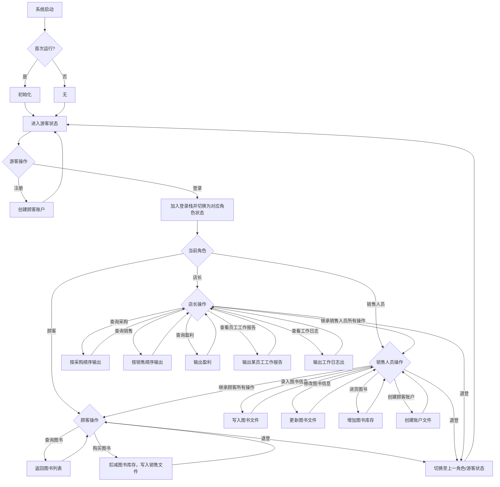
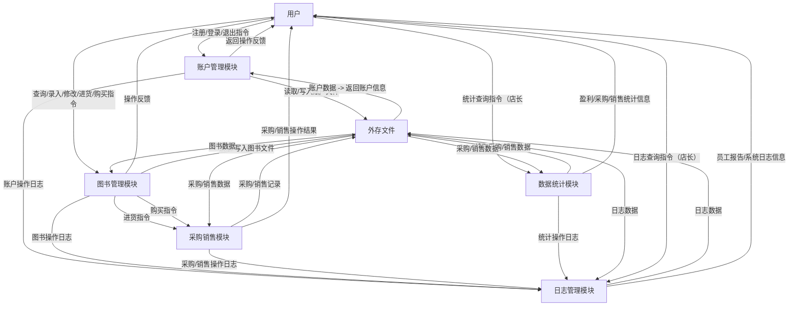

# 需求分析文档

## 业务流图

## 数据流图

## 数据词典

| 文件名称 | 数据结构列表 | 存储介质 | 说明 |
| --- | --- | --- | --- |
| 账户文件（account.txt） | {账户名（account_name）、密码（password）、角色（role）、创建时间（create_time）} | 硬盘 | 存储所有账户的信息，支持账户注册、登录、权限判断等操作的数据读写 |
| 图书文件（book.txt） | {ISBN（isbn）、书名（book_name）、作者（author）、关键字（keywords）、库存量（stock）、单价（price）、最后更新时间（update_time）、进价（purchase_price）} | 硬盘 | 存储所有图书的信息，支持图书录入、修改、查询、进货、购买等操作的数据读写 |
| 采购文件（purchase.txt） | {采购 ID（purchase_id，自增）、ISBN（isbn）、进货数量（purchase_num）、进货价格（purchase_price）、进货时间（purchase_time）、操作账户（operate_account）} | 硬盘 | 存储所有图书的进货记录，支持采购信息查询、盈利计算等操作的数据读写 |
| 销售文件（sale.txt） | {销售 ID（sale_id，自增）、ISBN（isbn）、销售数量（sale_num）、销售单价（sale_price）、销售时间（sale_time）、操作账户（operate_account）} | 硬盘 | 存储所有图书的销售记录，支持销售信息查询、盈利计算等操作的数据读写 |

## 功能说明

### 系统基础模块

系统启动与初始化的核心模块，无角色权限限制，为系统运行提供基础支撑。

|功能名称|输入参数|输出参数|
|---|---|---|---|
|系统启动检测|无|启动状态提示、首次运行标识|
|首次运行初始化|无|初始化成功提示 |
|非首次运行加载|无|数据加载成功/失败提示|

### 账户管理模块

负责账户的注册、登录、退出及权限控制，不同角色拥有不同操作权限。

|功能名称|权限角色|输入参数|输出参数|
|---|---|---|---|
|游客注册顾客账户|游客|account_name、password|注册成功/失败|
|账户登录|所有角色（游客触发）|account_name、password|登录成功/失败提示、当前角色、登录栈状态|
|退登|已登录角色（顾客/销售人员/店长）|无|退出成功提示、切换后角色/游客状态|
|创建顾客账户（后台）|销售人员/店长|account_name、password|创建成功/失败|
|账户密码修改|已登录角色（顾客/销售人员/店长）|old_password、new_password|修改成功/失败|

### 图书管理模块

核心业务模块，涵盖图书的查询、录入、修改、进货、购买等操作，权限随角色递增。

|功能名称|权限角色|输入参数|输出参数|
|---|---|---|---|
|图书多条件查询|顾客/销售人员/店长|可选参数组合：isbn、--name、--author、--keywords|匹配图书/ 无匹配提示|
|图书信息录入|销售人员/店长|isbn、book_name、author、keywords、stock、price|录入成功/失败|
|图书信息修改|销售人员/店长|isbn、待修改字段及对应值|修改成功/失败提示、修改后完整图书信息|
|图书进货|销售人员/店长|isbn、purchase_num、purchase_price|进货成功/失败提示、更新后库存量、进货总金额|
|图书购买|顾客/销售人员/店长|isbn、sale_num（整型）|购买成功/失败、消费总金额、剩余库存量|

### 数据统计模块

仅店长可操作，用于采购、销售、盈利数据的统计查询及员工工作监管。

|功能名称|权限角色|输入参数|输出参数|
|---|---|---|---|
|采购记录查询|店长|start_time、end_time|时间段采购记录列表 / 无记录|
|销售记录查询|店长|start_time、end_time|时间段销售记录列表 / 无记录|
|盈利数据统计|店长|start_time、end_time|销售收入、采购支出、利润|
|员工工作报告查询|店长|staff_account、start_time、end_time|员工操作记录列表/ 无记录|
|系统日志查询|店长|start_time、end_time|系统操作日志列表/ 无记录|

## 用户交互设计
### 游客

|命令格式|
|---|
|register <account_name> <password>|
|login <account_name> <password>|
### 顾客（继承游客）

|命令格式|
|---|
|query_book [--isbn <isbn>] <book_name> <author> <keywords>|
|buy_book <isbn> <sale_num>|
|change_pwd <old_password> <new_password>|
### 销售人员（继承顾客）

|命令格式|
|---|
|add_book <isbn> <book_name> <author> <keywords> <stock> <price>|
|modify_book <isbn> <book_name> <author> <keywords> <price>|
|purchase_book <isbn> <purchase_num> <purchase_price>|
|create_customer <account_name> <password>|
### 店长（继承销售人员）

|命令格式|
|---|
|stat_purchase <start_time> <end_time>|
|stat_sale <start_time> <end_time>|
|stat_profit <start_time> <end_time>|
|query_staff_log <staff_account> <start_time> <end_time>|
|query_system_log <start_time> <end_time>|